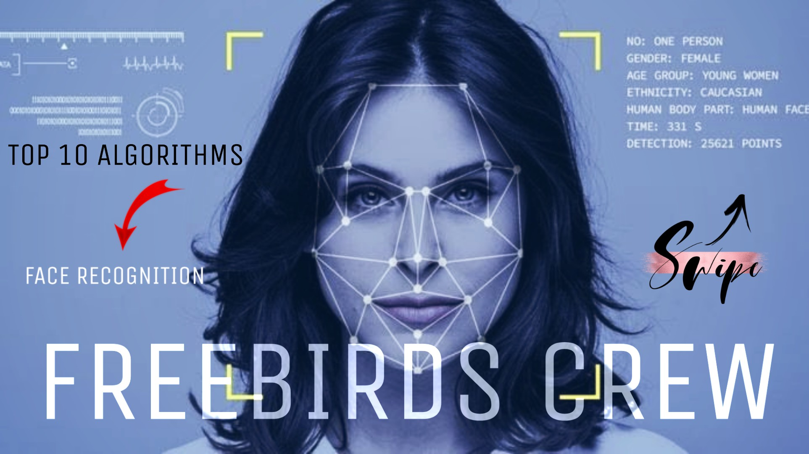

# Real-Time_Face_Recognition

1. ADA BOOST LEARNING AlGORITHM ( Uploaded )

9 More Algorithms are coming soon....

### Facial recognition is a category of biometric software that maps an individual's facial features mathematically and stores the data as a face print. The software uses deep learning algorithms to compare a live capture or digital image to the stored face print in order to verify an individual's identity.

•	When it comes to errors, there are two key concepts to understand: 

A “false negative” is when the face recognition system fails to match a person’s face to an image that is, in fact, contained in a database. In other words, the system will erroneously return zero results in response to a query.

A “false positive” is when the face recognition system does match a person’s face to an image in a database, but that match is actually incorrect. This is when a police officer submits an image of “Joe,” but the system erroneously tells the officer that the photo is of “Jack.”

### Note that Happens in US the Reason is this – 
Although the FBI purports its system can find the true candidate in the top 50 profiles 85% of the time, that’s only the case when the true candidate exists in the gallery. If the candidate is not in the gallery, it is quite possible the system will still produce one or more potential matches, creating false positive results. These people—who aren’t the candidate—could then become suspects for crimes they didn’t commit.

### How Does Facial Recognition Work?
The technology systems can sometimes vary when it comes to facial recognition, but the general functioning is as follows.

#### Step 1: Face Detection
To begin, the camera will detect and recognize a face, either alone or in a crowd. The face is best detected when the person is looking directly at the camera. The technological advancements have enabled slight variations from this to work as well.

#### Step 2: Face Analysis
Next, a photo of the face is captured and analyzed. Most facial recognition relies on 2D images rather than 3D because it can more conveniently match a 2D photo with public photos or those in a database. Distinguishable landmarks or nodal points make up each face. Each human face has 80 nodal points. Facial recognition software will analyze the nodal points such as the distance between your eyes or the shape of your cheekbones.

#### Step 3: Converting An Image to Data
The analysis of your face is then turned into a mathematical formula. These facial features become numbers in a code. This numerical code is called a faceprint. Similar to the unique structure of a thumbprint, each person has their own faceprint.

#### Step 4: Finding a Match
Your code is then compared against a database of other faceprints. This database has photos with identification that can be compared.

Follow us on Instagram for Daily Updates - https://www.instagram.com/freebirdscrew
Youtube -  https://lnkd.in/esEC6bE
